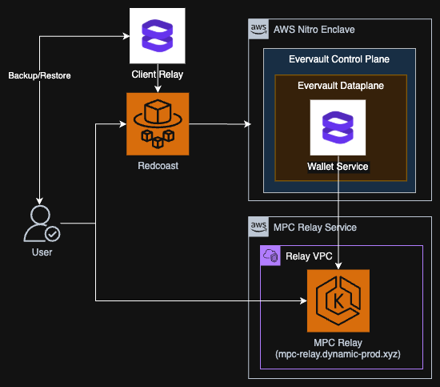

# Wallet Service

This is the Wallet Service for Dynamic Wallet MPC wallets (v3). It is responsible for acting as a server party for MPC ceremonies using the [Dynamic Labs Wallet SDK server package](https://github.com/dynamic-labs-wallet/dynamic-labs-wallet-sdk) deployed as an [Evervault enclave](https://docs.evervault.com/primitives/enclaves).



## Getting Started

1. `npm install` to install the dependencies
2. `npm run install:ev-enclave` to install the Evervault CLI
3. run `ev-enclave dev` to start a local enclave encyrption service
4. run `npm run start` to start the server

## Deployment

1. Configure the environment variables

Get the cert.pem and key.pem values from [1password](https://dynamiclabs.1password.com/app#/rhp23qqkejew7hlnibh5gx2mja/Search/rhp23qqkejew7hlnibh5gx2mjax3lh7sxyl3q2dtq2pmvckxqy7u?itemListId=deploy) or create new ones in the root of the project. Add `NPM_TOKEN` to the environment variables.

2. Build the enclave

Build the enclave with the following command:

```
 ev enclave build -c enclave.preprod.toml --private-key key.pem --signing-cert cert.pem --build-secret id=NPM_TOKEN .
```

3. Deploy the enclave with API key:

```
EV_API_KEY=<api-key> ev-enclave deploy -c enclave.preprod.toml --private-key key.pem --signing-cert cert.pem
```

## Scaling

To scale the enclave, you can use the following command:

```
EV_API_KEY=<api-key> ev enclave scale -c enclave.preprod.toml --desired-replicas <number-of-instances>
```
